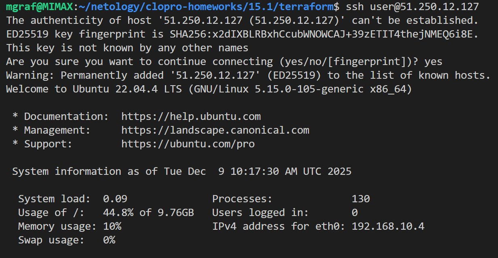
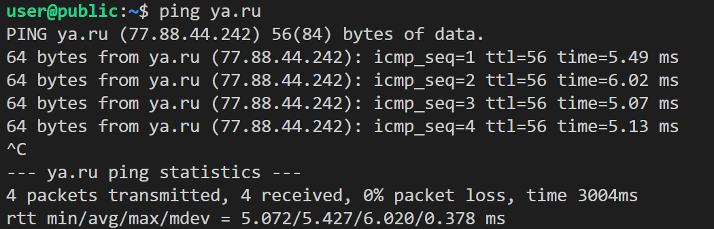
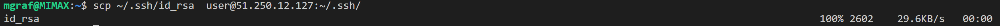
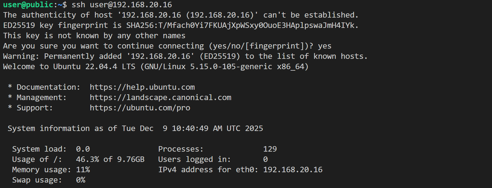
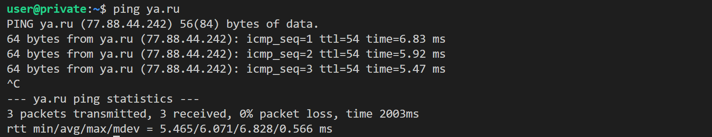

# Домашнее задание к занятию «Организация сети»

### Подготовка к выполнению задания

1. Домашнее задание состоит из обязательной части, которую нужно выполнить на провайдере Yandex Cloud, и дополнительной части в AWS (выполняется по желанию). 
2. Все домашние задания в блоке 15 связаны друг с другом и в конце представляют пример законченной инфраструктуры.  
3. Все задания нужно выполнить с помощью Terraform. Результатом выполненного домашнего задания будет код в репозитории. 
4. Перед началом работы настройте доступ к облачным ресурсам из Terraform, используя материалы прошлых лекций и домашнее задание по теме «Облачные провайдеры и синтаксис Terraform». Заранее выберите регион (в случае AWS) и зону.

---
### Задание 1. Yandex Cloud 

**Что нужно сделать**

1. Создать пустую VPC. Выбрать зону.
2. Публичная подсеть.

 - Создать в VPC subnet с названием public, сетью 192.168.10.0/24.
 - Создать в этой подсети NAT-инстанс, присвоив ему адрес 192.168.10.254. В качестве image_id использовать fd80mrhj8fl2oe87o4e1.
 - Создать в этой публичной подсети виртуалку с публичным IP, подключиться к ней и убедиться, что есть доступ к интернету.
3. Приватная подсеть.
 - Создать в VPC subnet с названием private, сетью 192.168.20.0/24.
 - Создать route table. Добавить статический маршрут, направляющий весь исходящий трафик private сети в NAT-инстанс.
 - Создать в этой приватной подсети виртуалку с внутренним IP, подключиться к ней через виртуалку, созданную ранее, и убедиться, что есть доступ к интернету.

Resource Terraform для Yandex Cloud:

- [VPC subnet](https://registry.terraform.io/providers/yandex-cloud/yandex/latest/docs/resources/vpc_subnet).
- [Route table](https://registry.terraform.io/providers/yandex-cloud/yandex/latest/docs/resources/vpc_route_table).
- [Compute Instance](https://registry.terraform.io/providers/yandex-cloud/yandex/latest/docs/resources/compute_instance).

-----------------

### Решение задания 1.
#### 1. Создаем [пустую VPC](./terraform/main.tf):
```bash  
# main.tf

resource "yandex_vpc_network" "network" {
  name = var.vpc_network_name
}
```
#### 2. [Публичная подсеть](./terraform/public.tf).
- Создаем VPC subnet с названием public, сетью 192.168.10.0/24.
```bash  
//
// Create a new VPC Subnet.
//
resource "yandex_vpc_subnet" "public" {
  name           = var.public_subnet
  zone           = var.default_zone
  network_id     = yandex_vpc_network.network.id
  v4_cidr_blocks = var.public_cidr
}
```
- Создаем в этой подсети NAT-инстанс, присвоив ему адрес 192.168.10.254. В качестве image_id используем fd80mrhj8fl2oe87o4e1.
```bash  
//
// Create a new NAT-instance
//
resource "yandex_compute_instance" "nat" {
  name        = var.yandex_compute_instance_nat[0].vm_name
  platform_id = var.yandex_compute_instance_nat[0].platform_id
  hostname = var.yandex_compute_instance_nat[0].hostname

  resources {
    cores         = var.yandex_compute_instance_nat[0].cores
    memory        = var.yandex_compute_instance_nat[0].memory
    core_fraction = var.yandex_compute_instance_nat[0].core_fraction
  }

  boot_disk {
    initialize_params {
      image_id = var.boot_disk_nat[0].image_id
      type     = var.boot_disk_nat[0].type
      size     = var.boot_disk_nat[0].size
    }
  }

  metadata = {
    ssh-keys = "user:${local.ssh-keys}"
    serial-port-enable = "1"
  }

  network_interface {
    subnet_id  = yandex_vpc_subnet.public.id
    nat        = true
    ip_address = var.yandex_compute_instance_nat[0].ip_address
  }
  scheduling_policy {
    preemptible = true
  }
}
```
- Создаем в этой публичной подсети виртуалку с публичным IP
```bash  
//
// Create a new Compute Instance
// 
resource "yandex_compute_instance" "public" {
  name        = var.yandex_compute_instance_public[0].vm_name
  platform_id = var.yandex_compute_instance_public[0].platform_id
  hostname = var.yandex_compute_instance_public[0].hostname

  resources {
    cores         = var.yandex_compute_instance_public[0].cores
    memory        = var.yandex_compute_instance_public[0].memory
    core_fraction = var.yandex_compute_instance_public[0].core_fraction
  }

  boot_disk {
    initialize_params {
      image_id = var.boot_disk_public[0].image_id
      type     = var.boot_disk_public[0].type
      size     = var.boot_disk_public[0].size
    }
  }

  metadata = {
    ssh-keys = "user:${local.ssh-keys}"
    serial-port-enable = "1"
  }

  network_interface {
    subnet_id  = yandex_vpc_subnet.public.id
    nat        = true
  }
  scheduling_policy {
    preemptible = true
  }
}
```
Подключияемся к VPS "public": 
  
  
и проверяем доступ в интернет:
  

#### 3. [Приватная подсеть](./terraform/private.tf).  
- Создаем VPC subnet с названием private, сетью 192.168.20.0/24.  
```bash  
//
// Create a new VPC Subnet.
//
resource "yandex_vpc_subnet" "private" {
  v4_cidr_blocks = var.private_cidr
  zone           = var.default_zone
  network_id     = yandex_vpc_network.network.id
  route_table_id = yandex_vpc_route_table.private-route.id
}

```  
- Создаем route table. Добавляем статический маршрут, направляющий весь исходящий трафик private сети в NAT-инстанс.
```bash  
//
// Create a new VPC Route Table.
//
resource "yandex_vpc_route_table" "private-route" {
  network_id = yandex_vpc_network.network.id

  static_route {
    destination_prefix = "0.0.0.0/0"
    next_hop_address   = var.yandex_compute_instance_nat[0].ip_address
  }
}
```  
- Создаем в этой приватной подсети виртуалку с внутренним IP
```bash  
//
// Create a new Compute Instance
//
resource "yandex_compute_instance" "private" {
  name        = var.yandex_compute_instance_private[0].vm_name
  platform_id = var.yandex_compute_instance_private[0].platform_id
  hostname = var.yandex_compute_instance_private[0].hostname

  resources {
    cores         = var.yandex_compute_instance_private[0].cores
    memory        = var.yandex_compute_instance_private[0].memory
    core_fraction = var.yandex_compute_instance_private[0].core_fraction
  }

  boot_disk {
    initialize_params {
      image_id = var.boot_disk_private[0].image_id
      type     = var.boot_disk_private[0].type
      size     = var.boot_disk_private[0].size
    }
  }

  metadata = {
    ssh-keys = "user:${local.ssh-keys}"
    serial-port-enable = "1"
  }

  network_interface {
    subnet_id  = yandex_vpc_subnet.private.id
    nat        = false
  }
  scheduling_policy {
    preemptible = true
  }
}
```  
Подключаемся к ней через виртуалку, созданную ранее.  
Для этого копируем свой приватный ssh-ключ на публичную виртуальную машину.  
  
Далее с публичной виртуальной машины подключусь к приватной по внутреннему IP адресу:  
  
и проверяем, что есть доступ к интернету с приватной VPS:  
  
-----------------------------
### [Код проекта](./terraform/)  

Resource Terraform for AWS:

1. [VPC](https://registry.terraform.io/providers/hashicorp/aws/latest/docs/resources/vpc).
2. [Subnet](https://registry.terraform.io/providers/hashicorp/aws/latest/docs/resources/subnet).
3. [Internet Gateway](https://registry.terraform.io/providers/hashicorp/aws/latest/docs/resources/internet_gateway).

### Правила приёма работы

Домашняя работа оформляется в своём Git репозитории в файле README.md. Выполненное домашнее задание пришлите ссылкой на .md-файл в вашем репозитории.
Файл README.md должен содержать скриншоты вывода необходимых команд, а также скриншоты результатов.
Репозиторий должен содержать тексты манифестов или ссылки на них в файле README.md.
